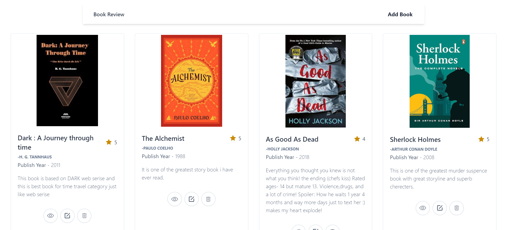
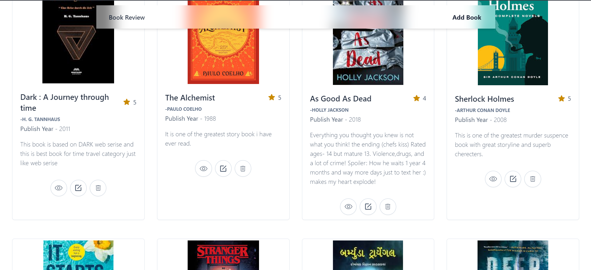
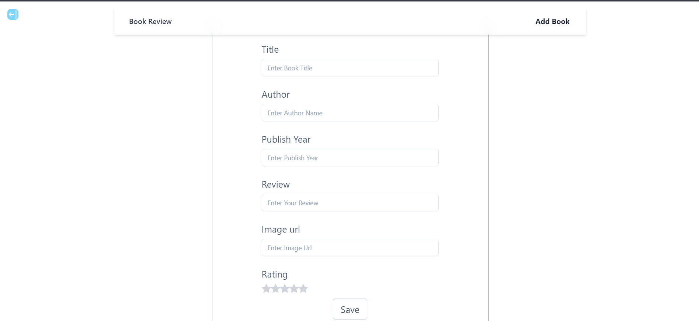
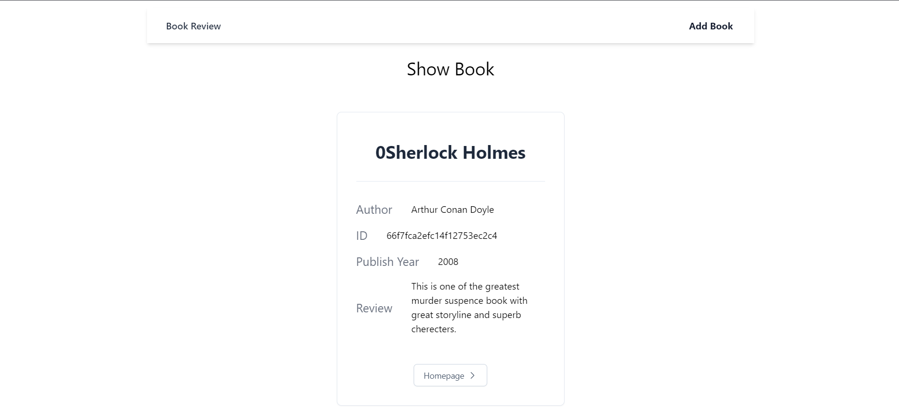

# 📖  Book App

Welcome to the **MERN Movie App**! This application lets you explore movies and manage your own watchlist by adding or removing movies.

## 🖼️ Screenshots

## Home Page

### WIth transparencey effect

## Add Book

## See detailed view of Book

## You can also delete book

## 🚀 Features

- **Add Book to Home Page**: Easily add your favorite Book to your personal Home Page.
- **Remove Book**: Remove Book once you’ve readed them.
- **Responsive Design**: The app works on both desktop and mobile devices.

## 🛠️ Tech Stack

- **MongoDB**: For storing the user’s watchlist.
- **Express.js**: For building the backend API.
- **React.js**: For creating the dynamic frontend user interface.
- **Node.js**: For server-side JavaScript.
